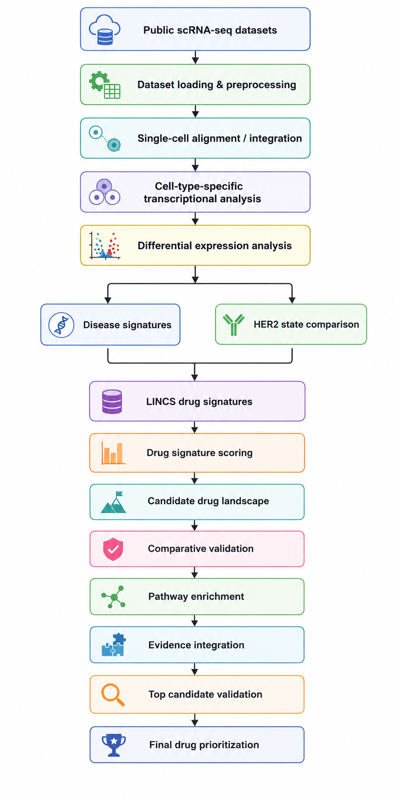

<p align="center">
  
</p>

<h1 align="center">
HER2-Positive Breast Cancer scRNA-seq Drug Repurposing
</h1>

<p align="center">

Single-cell transcriptomic analysis and LINCS-based computational drug repurposing in HER2-positive breast cancer

</p>

<p align="center">
  


</p>
---

# Overview

This project investigated **computational drug repurposing opportunities in HER2-positive breast cancer** using single-cell RNA sequencing (scRNA-seq) and large-scale perturbational gene-expression signatures from the **LINCS L1000** resource.

The analysis integrated normal breast epithelial cells with HER2-positive breast cancer samples and compared transcriptional states across disease and treatment-related contrasts. Disease-associated transcriptional signatures were then compared with LINCS drug perturbation profiles to identify candidate compounds whose transcriptional effects could potentially reverse or modulate disease-associated states.

The workflow subsequently integrated **drug-level statistical evidence, cell-type specificity, pathway enrichment, gene-level evidence, and comparative validation** to prioritize candidate drugs.

### Key computational candidates

| Rank | Drug | Candidate class | Final evidence score |
|---:|---|---|---:|
| 1 | **Neratinib** | Transition-associated | **0.9212** |
| 2 | **Vorinostat** | Treatment-contrast-specific | **0.7058** |
| 3 | **Bortezomib** | Treatment-contrast-specific | **0.4425** |

These candidates represent **computational drug-repurposing hypotheses** and require experimental and clinical validation.

---

## Project Context

**Mitacs Research Internship — Western University, 2023**

This project was conducted as part of a computational biology research internship focused on single-cell transcriptomics and drug repurposing in breast cancer.

The original analysis was not fully documented at the time. The analysis was subsequently reconstructed and systematically documented in 2026 to preserve the computational workflow, results, and interpretation for reproducibility and portfolio use.

---

# Research Question

Can single-cell transcriptional states in HER2-positive breast cancer be used together with LINCS perturbational signatures to identify and prioritize candidate drugs for computational repurposing?

The analysis was designed to address this question through several levels of evidence:

1. Identify disease-associated transcriptional changes.
2. Compare disease signatures against drug perturbation signatures.
3. Identify candidate compounds with potentially relevant transcriptional effects.
4. Compare candidates across HER2-positive breast cancer states.
5. Evaluate pathway-level biological evidence.
6. Validate the strongest candidates using gene- and pathway-level evidence.
7. Produce an integrated evidence-based drug ranking.

---

# Analysis Workflow

The complete computational workflow follows a progressive narrowing strategy:

<p align="center">
  
</p>

---

# Datasets

## Normal breast tissue

### GSE113197

Normal breast epithelial single-cell RNA-seq data were used to characterize baseline epithelial transcriptional states.

Selected GSM samples from the dataset were analyzed as individual samples.

## HER2- positive breast cancer

### GSE176078

HER2-positive breast cancer single-cell RNA-seq data were used to characterize tumor-associated epithelial states and treatment-associated transcriptional changes.

The analysis included the HER2-positive patient samples:

- CID4066
- CID3586

## LINCS perturbational data

Drug perturbation signatures were derived from the LINCS/L1000 framework using:

- GSE70138
- GSE92742

These datasets provide large-scale transcriptional responses to chemical perturbations and were integrated with the disease-associated single-cell signatures.

---

# Analysis

## 1. Dataset loading and preparation [01_loading_dataset.R]

Loads and prepares the single-cell datasets and associated metadata.

Outputs include processed expression objects, metadata, and intermediate datasets required for downstream analysis.

## 2. Single-cell alignment [02_single_cell_alignment.R]

Performs alignment/integration of the relevant single-cell datasets and prepares the HER2-positive breast cancer objects for downstream cell-type-specific analysis.

## 3. Differential expression analysis [03_DEG_limma.R]

Performs cell-type-specific differential expression analysis to identify genes associated with the relevant disease and treatment states.

The resulting transcriptional signatures form the basis for downstream drug-repurposing analysis.

## 4. Drug reference preparation [04_prepare_drug_reference.R]

Prepares the LINCS/L1000 perturbational reference used for drug-response analysis.

## 5. Drug scoring [05_drug_scoring.R]

Scores candidate drugs based on the relationship between disease/treatment-associated transcriptional signatures and LINCS perturbation signatures.

## 6. Drug comparison [06_drug_comparison.R]

Compares drug candidates across cell types and transcriptional states to identify:

- Shared candidates
- Treatment-associated candidates
- Transition-associated candidates
- Cell-type-specific candidates

## 7. Pathway enrichment [07_pathway_enrichment.R]

Performs pathway enrichment analysis on the transcriptional signatures associated with candidate drug perturbations.

Pathways were subsequently grouped into broader biological themes to reduce redundancy.

## 8. Pathway-drug integration [08_pathway_drug_integration.R]

Integrates drug-level scoring with pathway-level evidence to determine whether candidate drugs are supported by coherent biological processes.

## 9. Comparative validation [09_comparative_validation.R]

Performs comparative validation of candidate drugs across disease-associated and treatment-associated transcriptional states.

This step distinguishes candidates based on the type and strength of evidence supporting them.

## 10. Final evidence scoring [10_final_evidence_scoring.R]

Combines multiple evidence dimensions into a final computational ranking.

The integrated score considers:

- Drug therapeutic score
- Statistical significance
- Number of cell types supported
- Number of biological pathway themes
- Strength of pathway enrichment

## 11. Top-3 pathway validation [11_top3_pathway_validation.R]

Performs focused pathway-level validation of the three highest-ranked drug candidates.

## 12. Top-3 gene validation [12_top3_gene_validation.R]

Examines gene-level overlap and supporting evidence for the top-ranked candidates.

## 13. Figure generation [13_generate_figures.R]

Generates publication-style summary figures describing:

- Analysis workflow
- Therapeutic drug landscape
- Final evidence-based drug ranking
- Biological pathway evidence for the top candidates

---
# Key Results

The integrated computational framework prioritized three candidates:

| Rank | Drug | Candidate class | Final evidence score|
|-----------|------------|-----------|-----------|
| 1 | Neratinib | Transition-associated | 0.9212 |
| 2 | Vorinostat | Treatment-contrast-specific | 0.7058 |
| 3 | Bortezomib | Treatment-contrast-specific | 0.4425 |

## Neratinib

Neratinib was the highest-ranked candidate and was supported across two luminal epithelial cell populations.

The strongest pathway-level evidence involved:

- Translation / ribosomal processes
- Metabolic processes
- Amino-acid stress response
- Selenocysteine synthesis

## Vorinostat

Vorinostat showed strong treatment-associated evidence in basal epithelial cells.

Major pathway themes included:

- ECM / extracellular structure
- Mitochondrial respiration
- Oxidative phosphorylation

## Bortezomib

Bortezomib showed a similar basal epithelial treatment-associated pattern, with evidence involving:

- ECM / extracellular structure
- Mitochondrial respiration
- Oxidative phosphorylation

These results represent computational drug-repurposing hypotheses, not experimental validation or clinical recommendations.

---

# Repository Structure

```text
HER2-scRNAseq-Drug-Repurposing/
│
├── README.md
├── LICENSE
│
├── docs/
│   ├── analysis_overview.md
│   ├── data_sources.md
│   └── interpretation.md
│
├── scripts/
│   ├── 01_loading_dataset.R
│   ├── 02_single_cell_alignment.R
│   ├── 03_DEG_limma.R
│   ├── 04_prepare_drug_reference.R
│   ├── 05_drug_scoring.R
│   ├── 06_drug_comparison.R
│   ├── 07_pathway_enrichment.R
│   ├── 08_pathway_drug_integration.R
│   ├── 09_comparative_validation.R
│   ├── 10_final_evidence_scoring.R
│   ├── 11_top3_pathway_validation.R
│   ├── 12_top3_gene_validation.R
│   └── 13_generate_figures.R
│
├── assets/
│   ├── hulab_bannner.png
│   └── hulab_workflow.png
|
├── results/
│   ├── comparative_candidate_classes.csv
│   ├── final_candidate_summary.txt
│   ├── final_drug_evidence_scores.csv
│   ├── final_top3_drugs.csv
│   ├── nonredundant_pathway_themes.csv
│   ├── top3_gene_overlap.csv
│   ├── top3_gene_validation_summary.txt
│   ├── top3_pathway_theme_summary.csv
│   └── top3_strongest_pathways.csv
│
└── figures/
    ├── Figure1_workflow.png
    ├── Figure2_drug_landscape.png
    ├── Figure3_final_drug_ranking.png
    ├── Figure4_top3_biological_evidence.png
    └── reference_annotations.pdf
```
---

# Software and Tools

The analysis was primarily performed using:

- R
- Seurat
- limma
- dplyr
- ggplot2
- g:Profiler
- LINCS/L1000
- NCBI GEO

---

# Datasets

The project integrates publicly available transcriptomic datasets.

## Normal breast tissue

**NCBI GEO:** GSE113197  
**Relevant subseries:** GSE113196

Normal adult breast epithelial samples used:

| Sample | GEO accession |
|---|---|
| Individual 5 | GSM3099847 |
| Individual 6 | GSM3099848 |
| Individual 7 | GSM3099849 |

## HER2-positive breast cancer

**NCBI GEO:** GSE176078

Samples used:

| Sample | GEO accession |
|---|---|
| CID3586 | GSM5354513 |
| CID4066 | GSM5354521 |

The analysis uses the CID3586 and CID4066 samples to investigate transcriptional differences between HER2-positive breast cancer states.

## LINCS perturbational signatures

Two LINCS L1000 datasets were used:

- **GSE70138**
- **GSE92742**

These datasets provide large-scale perturbational gene-expression signatures used for computational drug-response and connectivity analysis.

### Data availability

The original datasets are publicly available through NCBI GEO and the LINCS resource.

The raw datasets are **not redistributed in this repository** because of their size. Users should download the source datasets directly from their respective repositories.

See [`docs/data_sources.md`](docs/data_sources.md) for the complete dataset description.

---

# Limitations

This analysis provides a computational framework for prioritizing candidate drugs based on transcriptional similarity and biological pathway evidence.

Important limitations include:

- Drug rankings are computational and require experimental validation.
- LINCS perturbational signatures may not fully reproduce responses in HER2-positive breast cancer cells.
- Single-cell datasets contain patient- and cell-state-specific variation.
- Pathway enrichment identifies statistical associations rather than establishing causality.
- The final evidence score is an analytical prioritization metric rather than a clinical efficacy score.

Therefore, the top-ranked candidates should be interpreted as hypotheses for further investigation.

---

# References

Key resources used in the project include:

- Seurat: single-cell RNA-seq analysis
- GEO: Gene Expression Omnibus
- LINCS: Library of Integrated Network-Based Cellular Signatures
- R: statistical computing and visualization

Dataset-specific and software-specific citations should be added when the corresponding resources are used in formal scientific work.

---

# Acknowledgements

This project builds upon publicly available datasets, computational resources, and open-source scientific software.

Special thanks to:

- GEO contributors
- LINCS / Connectivity Map community
- Seurat development team
- R and Bioconductor communities
- Open-source computational biology community

---

# License

This project is licensed under the **MIT License**.

See the [LICENSE](LICENSE) file for details.

---

# Connect With Me

**Abhimanyu Mandal**

- LinkedIn: https://www.linkedin.com/in/abhimanyu-mandal/
- Portfolio: https://abhimanyumandal.github.io/Personal-Portfolio/
- Email: abhimanyumandal0810@gmail.com

---

<div align="center">

### ⭐ If you found this repository useful, please consider giving it a Star!

</div>
